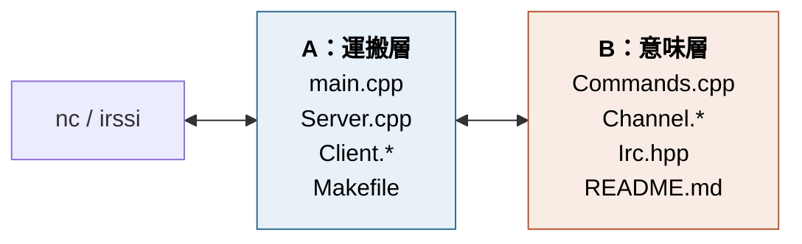
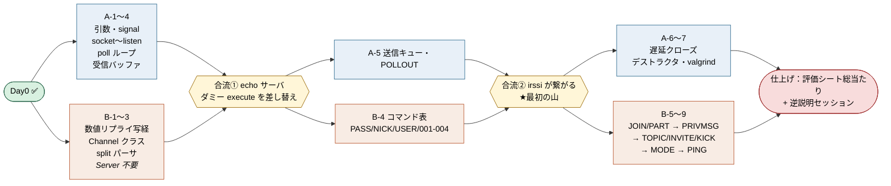

## 担当



- A = socket / poll / バッファ　B = パーサ / コマンド / チャンネル
- 各ファイルの 1 行目に `// A's part` / `// B's part`。どっちが書くかはそれを見る
- **共有ファイルは `inc/Server.hpp` だけ。** 触る前に一言、追加のみ、整形しない

## 注意点

| | |
|---|---|
| `execute(client, line)` | A→B。`line` は改行を除いた完全な 1 行 |
| `push(message)` | B→A。CRLF は push が付ける。send はしない |
| `quit(client, reason, ok)` | B→A。close の判断は A |

## 進め方



**すり合わせは2か所** あとは各自のブランチで進める。1 日 1 回ぐらいでmainに合流。

## 動作確認

```sh
ss -lnt | grep 6667                  # LISTEN。待機中 top で CPU 0%
nc -C localhost 6667                 # PASS→NICK→USER で 001〜004 が4行
{ printf 'NI'; sleep 3; printf 'CK a\r\n'; } | nc -q1 localhost 6667   # 分割送信
printf 'PASS wrong\r\n' | nc -q1 localhost 6667   # 464 が出てから切れる
nc を Ctrl-Z → 2万行流す → fg        # 全部届く。他clientは止まらない
valgrind --leak-check=full ./ircserv 6667 pass    # 接続張ったままCtrl-C
```

## 提出前

```sh
grep -rn '::poll' src/                # 1箇所
grep -rn 'errno\|fork\|select' src/   # 0件
grep -rn 'echo:' src/                 # 0件（ダミー消し忘れ）
make && make                          # 2回目は何もしない
```
